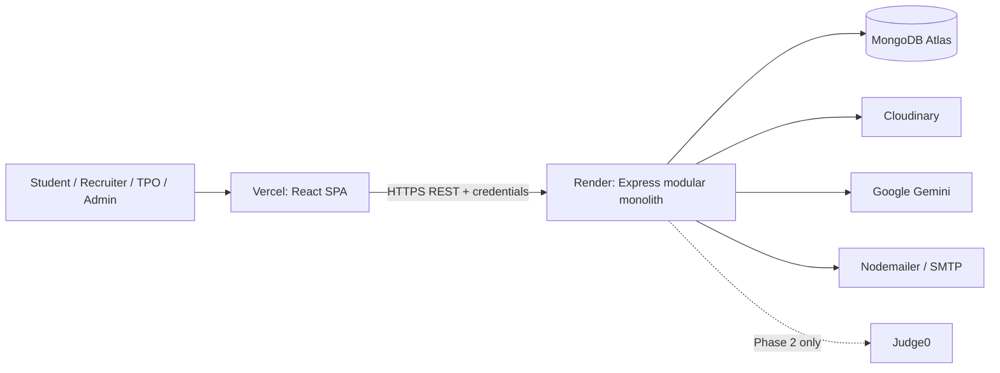
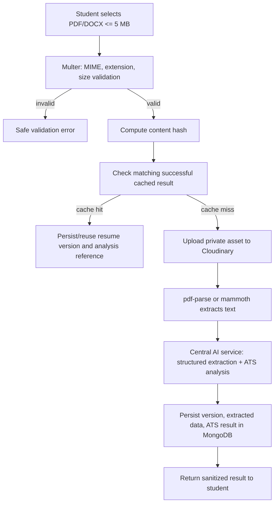
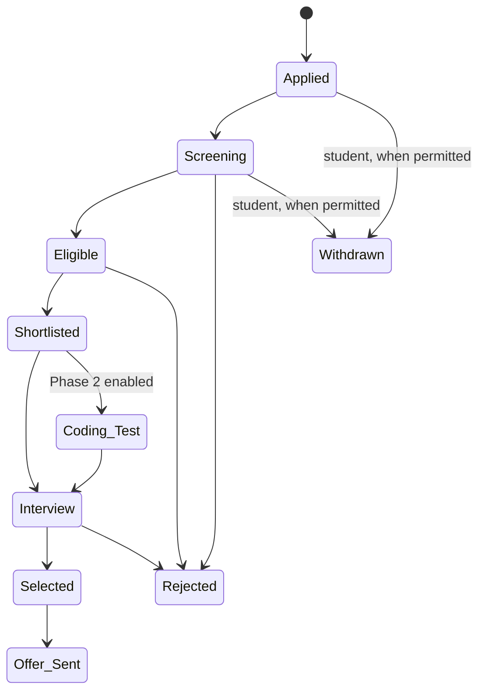
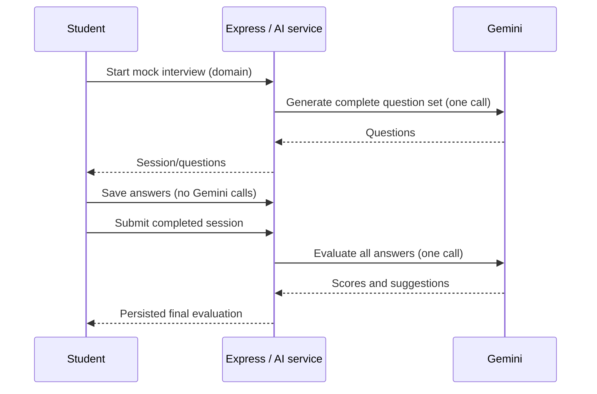
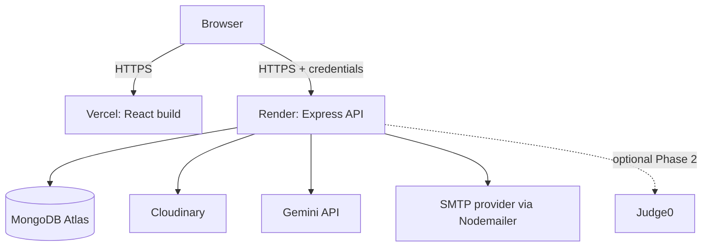

# NexHire System Architecture

> **Status:** Approved initial blueprint (MVP/core + explicit Phase 2 boundaries)  
> **Project:** NexHire – AI-Powered Campus Recruitment & Placement Platform  
> **Tagline:** Connecting Students, Colleges, and Recruiters through AI.

## 1. Project Overview

NexHire is a responsive web platform for one college/institution to manage its end-to-end campus placement lifecycle. It serves Students, Recruiters, Training & Placement Officers (TPOs), and Administrators in one modular MERN application. AI assists students with resumes and mock interviews, while all eligibility, workflow, ranking, and selection decisions remain explainable backend rules or human decisions.

This document is the architectural source of truth. Future implementation work must read it first and update it only when a genuine architectural decision changes.

## 2. Goals

- Deliver a realistic, maintainable third-year MERN project using primarily free tiers.
- Centralize placement profiles, jobs, applications, interviews, offers, notifications, and reporting.
- Keep modules independently buildable during Rapid Application Development (RAD), without microservices.
- Protect personal data and credentials with practical security controls.
- Use Gemini sparingly, consistently, and only for advisory AI capabilities.
- Keep the UI responsive and the code understandable for a student team.

## 3. Scope and Delivery Boundaries

### MVP / core implementation

Authentication and approval, student profiles, versioned resume upload and ATS advice, jobs, deterministic eligibility, applications and status history, recruiter applicant management, interview scheduling/feedback, AI mock interviews, PDF offers, notifications, dashboards, TPO/Admin functions, basic audit logging, and reporting are core scope.

### Phase 2

Coding tests, questions, submissions, and optional Judge0 execution are a separately enabled module. Core application and ranking screens must work when no coding score exists.

### Future scope (not committed)

Additional AI providers, richer reporting exports, calendar integration, institution configuration for multi-college operation, and asynchronous/background job infrastructure may be evaluated only after the MVP is stable.

## 4. Technology Stack

| Area | Chosen technology | Architectural use |
|---|---|---|
| Frontend | React, Vite, Tailwind CSS | SPA, responsive interface, reusable UI |
| Frontend utilities | React Router DOM, Axios, React Hook Form, Recharts | routing, API communication, forms, charts |
| Backend | Node.js, Express.js, Mongoose, Multer | REST API, business services, MongoDB models, uploads |
| Database | MongoDB Atlas | primary managed document database |
| Auth | JWT, bcrypt, httpOnly cookies | short access tokens, refresh-token session continuity |
| AI | Google Gemini API | resume extraction/analysis and mock-interview generation/evaluation |
| Document processing | pdf-parse, mammoth | PDF/DOCX text extraction |
| Storage | Cloudinary | private resume and generated-offer assets |
| Email | Nodemailer | transactional notifications and offer delivery |
| PDF generation | PDFKit | server-generated offer letters/reports where required |
| Hosting | Vercel, Render, MongoDB Atlas, Cloudinary | frontend, API, data, and files respectively |

No Redux, TanStack Query, Zod, Shadcn/UI, or additional enterprise infrastructure is part of this architecture.

## 5. Architectural Style

NexHire is a **modular monolith**: one React client, one Express API, and one MongoDB database. Backend modules use `Route → Middleware → Controller → Service → Model`. Controllers adapt HTTP requests/responses; services own business rules and cross-model orchestration; models own persistence rules. This keeps deployment simple while allowing modules to be developed incrementally and integrated frequently under RAD.



## 6. High-Level Module Boundaries

| Module | Owns | Key collaborators |
|---|---|---|
| Auth & users | credentials, account state, sessions, roles | Student/Recruiter profile creation, approval |
| Profiles & companies | role-specific data | Jobs, eligibility, dashboards |
| Resumes & AI | uploads, versions, extracted data, ATS analyses | Cloudinary, extraction utilities, central AI service |
| Jobs & eligibility | jobs, visibility, deterministic checks | Applications, student profiles |
| Applications & ranking | application pipeline/history, rankings | Jobs, profiles, interviews, Phase 2 score |
| Interviews & offers | schedules, feedback, offers/PDFs | Applications, notifications, email |
| TPO/Admin | institutional operations, announcements, complaints, audit | all governed modules |
| Notifications & analytics | user notices and aggregated read models | all action-producing modules |

Modules communicate through services in the same process, not internal HTTP APIs. Small shared utilities/constants are permitted; repositories, factories, and event-bus abstractions are intentionally omitted unless implementation proves a concrete need.

## 7. Frontend Architecture

```text
client/
  src/
    assets/                 # static images/icons
    components/             # reusable presentational UI (Button, Table, Modal, EmptyState)
    context/                # AuthContext; limited global UI context only if needed
    data/                   # static select options and demo-safe constants
    features/               # domain components/hooks: jobs/, applications/, resumes/, etc.
    hooks/                  # reusable hooks (useAuth, useDebounce)
    layouts/                # public and role-aware dashboard shells
    pages/                  # route-level pages grouped by role/domain
    services/               # Axios instance and domain API functions
    types/                  # shared JSDoc/TypeScript-ready shapes; choose one convention later
    utils/                  # formatting, date/status helpers
    App.jsx
    main.jsx
```

Pages compose feature components. Feature components call small domain API services rather than embedding Axios requests repeatedly. The Axios instance uses `withCredentials: true`; an interceptor may make one controlled refresh-and-retry attempt on an expired access token, then clears client auth state and redirects to login. Route guards improve UX but never replace backend authorization.

Role-aware navigation should be driven from a small route/permission configuration. Shared visual primitives stay in `components`; business-specific components stay in `features`.

## 8. Backend Architecture

```text
server/
  src/
    config/                 # environment validation, database, Cloudinary, mail setup
    constants/              # roles, statuses, limits, messages
    controllers/            # HTTP adapters only
    middleware/             # auth, RBAC, ownership, upload, validation, errors, rate limits
    models/                 # Mongoose schemas and indexes
    routes/                 # domain routers and route middleware composition
    services/               # business rules and external integrations
    validators/             # request validation rules/schemas (library-light)
    utils/                  # tokens, async handler, pagination, API error, PDF helpers
    app.js                  # Express configuration and routes
    server.js               # process startup/listening
```

Each router is mounted under `/api`. Services return domain values or deliberate application errors; the centralized error middleware maps them to stable, safe JSON responses. Database transactions are used only where an operation must atomically update multiple documents and MongoDB Atlas supports the needed replica-set capability—for example, creating an application plus its initial status history.

## 9. Database Architecture

All references use MongoDB `ObjectId`s. User identity is separate from role-specific profile data to keep credentials and common authorization fields in one collection. Denormalize only stable display snapshots where it avoids expensive dashboard lists (for example, company name on a job); the authoritative entity remains referenced.

| Collection | Purpose / ownership | Important fields and references | Indexes / validation |
|---|---|---|---|
| `users` | Auth/account owner; one per person | name, email, passwordHash, role, accountStatus, approvalStatus, refreshTokens, lastLoginAt | unique lowercase `email`; enums `STUDENT/RECRUITER/TPO/ADMIN`, `PENDING/APPROVED/REJECTED`, `ACTIVE/INACTIVE` |
| `students` | Student-owned placement profile | `user`, enrollment/rollNo, branch, CGPA, backlogs, education, skills, projects, experience, certifications, achievements | unique `user`, unique roll number where institution supplies it; branch enum/config; CGPA 0–10; non-negative backlogs |
| `recruiters` | Recruiter-owned company membership profile | `user`, `company`, designation, contact details, approval state | unique `user`; index `company`; only approved active recruiter can publish jobs |
| `companies` | Institution-approved employer profile | name, website, industry, location, description, logo reference, status | normalized unique `name`; index status; `PENDING/APPROVED/REJECTED/INACTIVE` |
| `jobs` | Company job/drive requirements; recruiter creates, company owns | `company`, `createdBy`, title, CTC, location, description, requiredSkills, deadline, minimumCGPA, allowedBranches, maximumBacklogs, status | indexes `{company,status}`, `{deadline,status}`, text index on title/company snapshot/skills if search needs it; constraints on dates/numbers |
| `applications` | Student-to-job record, owned by student, governed by job/company | `student`, `job`, submitted resume version, status, `statusHistory`, eligibilitySnapshot, withdrawal details, rankingScore | unique compound `{student,job}`; `{job,status}`, `{student,createdAt}`; controlled pipeline enum |
| `resumes` | Student-owned immutable upload versions and AI outputs | `student`, Cloudinary IDs/URLs, original file metadata, SHA-256 content hash, extractedText, structuredData, analyses, isCurrent | `{student,createdAt}`; unique compound `{student,contentHash}` if exact duplicate prevention is chosen; file type PDF/DOCX, max 5 MB |
| `interviews` | Per-application scheduled interview and feedback | `application`, `job`, `student`, `company`, schedule, mode, meeting/location, panelNotes, feedback, status, lifecycle timestamps | `{application,status}`, `{company,scheduledAt}`; enum `SCHEDULED/RESCHEDULED/COMPLETED/CANCELLED` |
| `offers` | Recruiter-generated offer, one accepted business offer per application policy | `application`, candidate/company snapshots, position, CTC, joiningDate, Cloudinary PDF reference, emailedAt, status | unique `{application}` initially; generated document metadata |
| `notifications` | Recipient-owned in-app notice | `recipient`, type, title, body, link, readAt, archivedAt, metadata | `{recipient,readAt,createdAt}`; archive at 90 days through a scheduled/manual maintenance task |
| `announcements` | TPO/Admin institutional message | `author`, title, content, audience roles/filters, publishedAt, expiryAt, status | `{status,publishedAt}`; audience role validation |
| `activityLogs` | Admin/audit record, system-owned | actor, action, targetType, targetId, timestamp, metadata (non-sensitive) | `{actor,createdAt}`, `{targetType,targetId,createdAt}`; do not store secrets or full request bodies |
| `complaints` | User-created issue handled by Admin | reporter, subject, description, status, handler, resolution | `{status,createdAt}`, `{reporter,createdAt}` |
| `mockInterviewSessions` | Student-owned AI mock interview state/results | `student`, domain, generatedQuestions, answers, evaluation, status, startedAt/completedAt | `{student,createdAt}`; `DRAFT/IN_PROGRESS/COMPLETED` |
| `codingTests` | **Phase 2** recruiter/company test definition | job, company, creator, rules, questions, availability | `{job,status}` |
| `questions` | **Phase 2** coding question bank/test-owned questions | codingTest, statement, constraints, samples, hidden tests | `{codingTest,order}`; hidden tests never returned to client |
| `submissions` | **Phase 2** student coding attempt/execution result | codingTest, question, student, language, source, Judge0 result, score | `{codingTest,student}`, `{question,student,createdAt}` |

`statusHistory` is embedded in Applications because it is small, ordered, and always read with the application. Each entry has `fromStatus`, `toStatus`, `changedBy`, `note`, and `changedAt`. Interview records remain separate because they can be scheduled/rescheduled independently.

## 10. Authentication Architecture

Registration collects minimally necessary fields, validates and normalizes email, hashes the password with bcrypt, creates the `users` record, then creates the applicable profile record. Student and recruiter accounts default to `PENDING` approval; TPO/Admin accounts are seeded/provisioned by an Admin rather than publicly registered. Pending, rejected, inactive, or deactivated accounts cannot receive authenticated sessions.

At login, the server validates credentials and account state. It returns a short-lived signed access token (for example, 15 minutes) in the JSON response/body and sets a longer-lived refresh token in a `Secure`, `httpOnly`, `SameSite=None` production cookie (or appropriate local-development setting). The refresh token is also stored as a hashed/session record in the user document, including expiry and optionally device/session metadata. Never store raw refresh tokens in MongoDB or localStorage.

```mermaid
sequenceDiagram
  participant B as Browser
  participant A as Express API
  participant D as MongoDB
  B->>A: POST /api/auth/login (email, password)
  A->>D: Find user and validate account state
  A->>A: bcrypt.compare; create access + refresh tokens
  A->>D: Store hashed refresh token/session
  A-->>B: access token JSON + Set-Cookie refreshToken (httpOnly)
  B->>A: Protected request: Authorization Bearer accessToken
  A->>A: authenticate + RBAC + ownership checks
  A-->>B: Authorized response
  B->>A: POST /api/auth/refresh (cookie sent automatically)
  A->>D: Validate/rotate stored refresh session
  A-->>B: New short-lived access token (+ rotated cookie)
```

Refresh rotation invalidates the presented session and creates a replacement. Logout clears the cookie and deletes/revokes its server-side refresh-token record. Password reset uses a short-lived, single-use hashed reset token and is delivered by configured email; all existing refresh sessions should be revoked when the password changes. The client keeps the access token only in memory, so a page reload silently refreshes it using the cookie.

## 11. Authorization and RBAC

Every protected endpoint enforces, in order:

1. Authentication: a valid access token identifies the active user.
2. Role permission: `authorizeRoles(...)` checks the route’s permitted roles.
3. Resource access/ownership: service or specific middleware verifies the user may act on that resource.

Student endpoints only expose their own profile, resumes, mock sessions, and applications. Recruiters can manage jobs for their company and view applicants only for those jobs. TPO has institution-wide placement operations. Admin has platform-level administration, audit visibility, and complaint handling. IDs submitted by clients are never trusted as proof of ownership; server-side queries scope them by the authenticated user/company where relevant.

## 12. AI Architecture

Only `services/aiService.js` (with prompts in a nearby `ai/` or `services/prompts/` folder) may call Gemini. Its conceptual methods are:

- `extractResumeData(text)` — validated structured candidate data.
- `analyzeResume(text, targetContext)` — ATS score, feedback, and keyword suggestions.
- `generateInterviewQuestions(domain, level, count)` — complete question set once per session.
- `evaluateMockInterview(session)` — complete-answer evaluation once after submission.

The service uses versioned prompts, strict JSON response parsing/validation, timeouts, retries only for safe transient failures, concise error mapping, and service-level rate limits. AI output is stored with model/prompt version and creation time. A SHA-256 hash of normalized resume file content is used as the cache key: a matching prior successful analysis can be reused unless the user explicitly requests a new analysis or a materially different job context requires a separate analysis key. Failed calls do not overwrite a last successful result.

AI is advisory only. Gemini never determines job eligibility, application status, candidate rank, shortlisting, rejection, or selection.

## 13. Resume Processing Flow



Multer accepts only PDF and DOCX with server-side file size enforcement (5 MB). The server, not the client, performs extraction and calls Gemini. Cloudinary credentials remain backend-only. Existing versions are retained; one is marked current. Files should use restricted/private delivery where Cloudinary configuration permits, and the API authorizes access before returning a signed download URL or proxying the request.

## 14. Jobs, Eligibility, Applications, and Ranking

Jobs are created and managed by an approved recruiter for an approved company. Publishing validates deadline, requirements, and company status. Job search/filter is server paginated, with a whitelist for sort fields to prevent arbitrary query execution.

On apply, the backend obtains the student profile and job requirements itself and computes eligibility deterministically:

```text
eligible = CGPA >= job.minimumCGPA
           AND student.branch is in job.allowedBranches
           AND student.backlogs <= job.maximumBacklogs
```

The eligibility result and relevant profile/job values are saved as an application snapshot for auditability. The server prevents duplicate applications via the compound unique index. Students may withdraw only before a documented cutoff (initially: before interview scheduling, unless a TPO/recruiter configuration later changes policy).



Allowed service-level transitions are explicitly defined in constants and validated before each change; no endpoint accepts an arbitrary status. Every transition appends status history and creates the appropriate notification.

Candidate ranking is a pure `rankingService`, independent from Gemini and controllers:

```text
rankingScore = 0.30 × normalizedResumeScore
             + 0.30 × normalizedCodingScore
             + 0.25 × normalizedInterviewScore
             + 0.15 × normalizedCgpaScore
```

All inputs are normalized to 0–100 and the component values are returned/displayed for transparency. Until Phase 2 is enabled, coding score is `null`, not zero; the ranking service supports a documented normalized-weight fallback across available inputs or the UI labels the score as incomplete. The exact fallback must be selected before ranking is exposed to recruiters.

## 15. Interview Workflow

Recruiters schedule, reschedule, cancel, and complete interviews for applications they are authorized to manage. Schedule data includes date/time (stored UTC, displayed locally), mode, meeting link or location, panel notes, structured feedback, and status. Schedule changes save timestamps and notify the student. Completing an interview allows feedback/score entry and may advance the application only through permitted pipeline transitions.

The AI mock interview is independent of a recruiter interview. A student selects domain (and configured difficulty/count); Gemini generates the full set once; answers are saved as the student progresses; the completed answer set is submitted once to Gemini for Technical Accuracy, Communication Quality, Completeness, and actionable suggestions.



No confidence detection, per-answer AI evaluation, or live/video interview analysis is in scope.

## 16. Offer Letter Workflow

For an authorized selected application, the recruiter enters approved offer values. The service builds a PDF using PDFKit from server-side data, uploads/stores its Cloudinary reference, creates an `offers` record, updates the application to `OFFER_SENT` when appropriate, generates a notification, and emails the candidate a safe download link or attachment. The process is idempotency-aware so a transient retry does not silently create duplicate offers.

## 17. Notification Architecture

Action services call a small `notificationService.create(...)`; this persists an in-app notification and, where important, delegates a transactional email to `emailService`. Notifications have recipient, type, content, optional safe application link, read timestamp, and archive timestamp. Read/unread updates are recipient-scoped. A simple scheduled maintenance endpoint/job on Render, or an Admin maintenance action, archives records older than 90 days; it does not delete them by default.

Initial delivery is polling on page load and after relevant actions. WebSockets are deliberately excluded.

## 18. Analytics Architecture

Dashboard APIs use MongoDB aggregation pipelines scoped by role and authorized organization. Aggregations provide counts, status funnels, packages, branches, placement percentage, and time series; React/Recharts renders them. Results use server-side date filters, sensible limits, and role-specific projections—never a raw database export to the browser. PDFKit can generate placement reports from the same service-level aggregation results.

## 19. File Storage Architecture

Cloudinary stores resume files, company logos if used, and generated offer PDFs. MongoDB stores only metadata, ownership, public-safe identifiers, and delivery references—not binary documents. Upload signatures/credentials are backend-only. File names are server-generated/sanitized, content type and byte limits are validated, and authorization is checked before serving private documents. Deleting/replacing a file follows a service operation that reconciles the Cloudinary asset and MongoDB metadata; historical resumes remain unless an approved retention policy later authorizes deletion.

## 20. REST API Structure

All APIs are version-ready under `/api`; an explicit `/api/v1` prefix may be introduced only when external versioning is needed. Responses consistently use `{ success, message, data, meta? }`; list endpoints use `meta` for pagination. Request bodies are validated before controllers call services.

| Base path | Responsibility |
|---|---|
| `/api/auth` | registration, login, refresh, logout, password reset |
| `/api/students`, `/api/recruiters`, `/api/companies` | profiles, approvals, company membership/details |
| `/api/jobs` | public/authorized listing, job details, recruiter management |
| `/api/applications` | apply, withdraw, applicant views, transitions, ranking view |
| `/api/resumes` | version upload/list/current/download/ATS results |
| `/api/interviews` | recruiter scheduling and feedback; student schedule views |
| `/api/offers` | authorized offer generation, view, download/email |
| `/api/notifications`, `/api/announcements` | recipient notification state and institutional communication |
| `/api/analytics` | role-scoped dashboard metrics and report generation |
| `/api/tpo`, `/api/admin` | institution and platform operations, audits, complaints |
| `/api/ai` | authenticated orchestration endpoints for mock interview/resume actions; no raw Gemini proxy |
| `/api/coding-tests` | **Phase 2 only**, mounted only when enabled |

## 21. Security Architecture

- Hash passwords with bcrypt; never log passwords, tokens, resume text, or SMTP secrets.
- Sign access and refresh JWTs with separate environment secrets and validate issuer/expiry as configured.
- Use refresh-token httpOnly, `Secure` production cookies; configure `SameSite` and credentialed CORS together for Vercel-to-Render traffic.
- Apply authentication, RBAC, and ownership checks to every protected resource.
- Validate and sanitize request input; use Mongoose validation as a second layer.
- Use Multer allowlists, 5 MB limits, and Cloudinary private access controls for files.
- Apply Helmet, API/auth rate limits, JSON body limits, controlled CORS, and secure error responses.
- Keep all keys in deployment environment variables; commit only `.env.example` with placeholders later.
- Enforce HTTPS in production and avoid stack traces/internal implementation details in client errors.

## 22. Error Handling Strategy

Controllers use an async wrapper and pass failures to one Express error middleware. Services throw typed/application errors such as `ValidationError`, `AuthenticationError`, `AuthorizationError`, `NotFoundError`, `ConflictError`, and controlled `ExternalServiceError`. The middleware maps them to appropriate HTTP codes and a stable response shape. Mongoose duplicate-key, cast, and validation errors are normalized. Production logs retain operational context and correlation IDs where practical but redact sensitive data; the client receives only an actionable message. Gemini, Cloudinary, SMTP, and database failure handling must distinguish retry-safe errors from user-actionable errors without leaking provider details.

## 23. State Management Strategy

- `useState` manages ordinary page/component state.
- `useReducer` manages complex local flows such as multi-step forms and mock-interview answers.
- `AuthContext` holds current user, in-memory access token, loading state, and auth actions.
- Optional small UI context is allowed only for genuinely cross-cutting state such as theme/alerts.
- Custom hooks encapsulate repeated fetch/mutation behavior using Axios and React state.
- Server data is fetched per route/feature and refreshed after mutations; Redux and server-state libraries are intentionally not introduced initially.

## 24. Deployment Architecture



Vercel receives a frontend build with only public configuration (for example `VITE_API_BASE_URL`). Render receives all server secrets. MongoDB Atlas network access is restricted to the deployment environment as feasible. Render must allow credentialed requests from the exact Vercel production/preview origin policy selected, and frontend calls must set credentials. Cookie attributes are tested in deployed HTTPS environments because cross-site cookie behavior is browser-sensitive.

## 25. Environment Configuration

Server configuration is loaded once at startup and fails fast for missing required production values. Recommended keys:

```text
NODE_ENV
PORT
MONGO_URI
JWT_ACCESS_SECRET
JWT_REFRESH_SECRET
JWT_ACCESS_EXPIRES_IN
JWT_REFRESH_EXPIRES_IN
GEMINI_API_KEY
CLOUDINARY_CLOUD_NAME
CLOUDINARY_API_KEY
CLOUDINARY_API_SECRET
SMTP_HOST
SMTP_PORT
SMTP_USER
SMTP_PASS
SMTP_FROM
CLIENT_URL
```

Development uses local client/API URLs and non-production-safe cookie settings only as necessary. Production uses secret managers/environment configuration, HTTPS, production client origin(s), and secure cookie settings. No secret is committed to Git.

## 26. Development and Implementation Strategy (RAD)

Build and demo usable increments in this order:

1. Foundation: repository conventions, environment templates, app shells, shared constants/error patterns.
2. Authentication and approval workflow.
3. Student profiles.
4. Resume upload/versioning, extraction, cache-aware ATS advisory analysis.
5. Jobs, browse/search/filter, and deterministic eligibility.
6. Applications, status history, recruiter applicant management, notifications.
7. Recruitment interviews, feedback, and application progression.
8. Standalone AI mock interview sessions.
9. Offer PDFs/email delivery.
10. Analytics and reports.
11. TPO/Admin operations, complaints, announcements, audit logs.
12. Integration testing, security review, responsive/accessibility QA, deployment.

Each increment should define a thin vertical slice (API, UI, validation, authorization, tests) and use feature branches/PRs where the team workflow permits. Do not build all schemas or screens at once.

## 27. Phase 2 Boundaries

Judge0 integration is isolated behind a `codingAssessmentService` and Phase 2 routes/models. It accepts a normalized submission request, sends code to Judge0, stores only the required result/score, and exposes a normalized result to ranking. The core ranking service must treat coding score as unavailable until the module is enabled. No core route, job creation form, or application state transition may require Judge0 to be operating.

## 28. Architectural Non-Goals

NexHire will not initially implement microservices, Kubernetes, Docker orchestration, Redis, Kafka, RabbitMQ, GraphQL, Elasticsearch, WebSockets, WebRTC, live video interviewing, LinkedIn integration, GitHub integration, a mobile application, a custom code execution engine, or an OCR pipeline. These do not provide enough value for the semester scope relative to their complexity.

## 29. Key Decisions and Rationale

| Decision | Rationale |
|---|---|
| Modular monolith | Best fit for a single college, student team, simple deployment, and RAD iterations. |
| Separate `users` and role profiles | Keeps credentials/common state consistent while profiles remain role-specific. |
| JWT access token + rotating httpOnly refresh cookie | Supports SPA sessions without placing long-lived tokens in JavaScript-accessible storage. |
| Backend-authoritative eligibility and ranking | Makes placement decisions transparent, testable, and free from AI variability. |
| Central AI service with hashes/versioned prompts | Controls cost, avoids redundant calls, makes output handling consistent, and permits provider replacement. |
| Cloudinary metadata in MongoDB | Keeps database lean and file ownership/access auditable. |
| Embedded application status history | The history is bounded and naturally belongs with the application. |
| MongoDB aggregations + Recharts | Meets analytics needs without an additional warehouse or BI system. |
| Polling notifications | Sufficient for the expected user scale; avoids WebSocket operational complexity. |
| Phase 2 coding module | Protects MVP delivery from Judge0 availability and integration complexity. |

## 30. Future Extension Points

- Provider adapter inside the central AI service for Gemini replacement or model upgrades.
- Configurable institutional rules for approval, branches, eligibility, withdrawal cutoffs, and application transitions.
- Optional scheduled worker mechanism for email retries, archive jobs, and long-running AI/file work if Render request limits demand it.
- Report export formats and approved data-retention policies.
- Multi-institution tenancy only through a deliberate future redesign; the MVP assumes one institution.
- Judge0-backed coding assessment behind the defined Phase 2 service boundary.

## 31. Architectural Risks and Open Decisions

1. **Cross-site refresh cookies:** Vercel and Render deployments require real-browser verification of `SameSite=None; Secure`, credentialed Axios requests, and exact CORS origins. If browser privacy policies materially block this flow, move frontend/API to same-site custom subdomains before changing token storage.
2. **Gemini quota/structured output:** Prompt payload sizes, rate limits, and JSON consistency must be tested early with sample resumes. Cache successful analyses and show retryable advisory failure states.
3. **Resume privacy:** The institution must decide retention and deletion policy before production. Until then, retain versions for placement traceability and authorize every download.
4. **Approval ownership:** Default proposed policy is TPO approves students and companies/recruiters; Admin manages TPO/Admin accounts and exceptional platform actions. Confirm this with the college before implementation.
5. **Ranking without coding tests:** The UI must not present Phase 2 scoring as final. Adopt either available-weight normalization or an explicit incomplete ranking state before exposing recruiter ranking.
6. **Email provider:** SMTP provider and sender domain are deployment choices; free-tier limits/deliverability must be validated during deployment.

## 32. Operating Rule for Future Sessions

Before any major implementation decision, read this document, confirm that the requested work fits it, reuse these boundaries and naming conventions, and make the smallest compatible implementation. Amend this document only for a true architectural decision/change, with a concise dated note in the relevant section.
